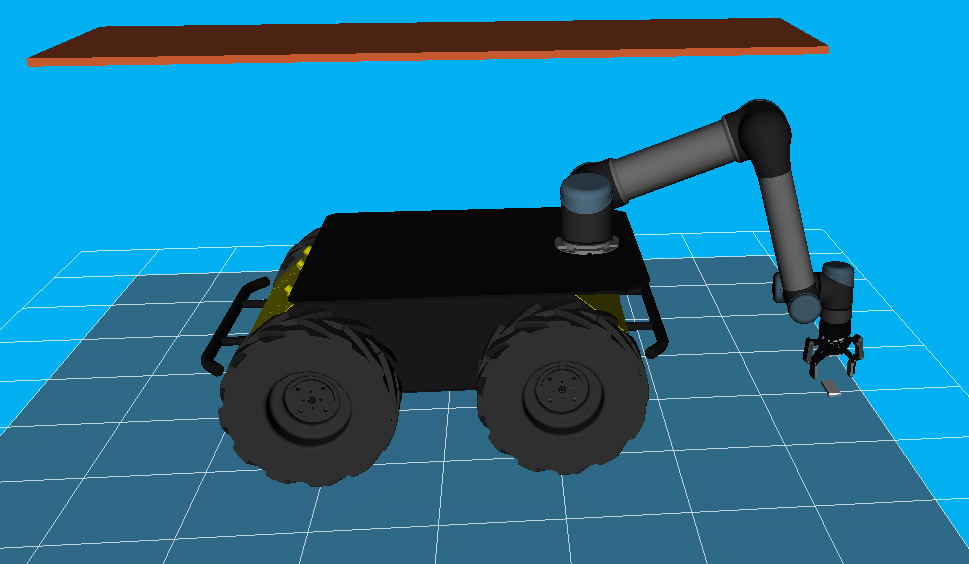

# Перемещение робота-манипулятора UR5 при помощи алгоритма TrajOpt

Краткое описание проекта:

```

├── data
├── scripts
└── src
    ├── libs
    ├── pkgs_husky
    ├── pkgs_ur5
    ├── rosbag
    ├── settings_custom_lib
    ├── ur5_husky_api
    ├── ur5_husky_camera
    ├── ur5_husky_main
    └── ur_rtde-v1.5.0

```

- **data** - конфиги для управления роботом
- **scripts** - bash-скрипты
- **src/libs** - библиотеки <a href="https://github.com/tesseract-robotics">Tesseract-Robotics</a> (реализация алгоритма TrajOpt)
- **src/pkgs_husky** - пакеты для мобильной платформы Husky
- **src/pkgs_ur5** - пакеты для манипулятора Universal Robots (UR5) и гриппера Robotiq
- **src/rosbag** - пакеты для обработки росбэгов
- **src/settings_custom_lib** - пакет для добавления конфигов из data/settings.txt в другие пакеты
- **src/ur5_husky_camera** - пакет для получения изображения с камеры робота (Realsence и Zed), для получения изображений необходимо запускать соответствующий пакет на роботе (src/ur5_husky_api)
- **src/ur5_husky_main** - пакет с реализацией управления роботом с помощью алгоритма TrajOpt
- **src/ur_rtde-v1.5.0** - пакет с библиотекой ur_rtde (точно такая же версия используется на роботе).



Что реализовано в проекте:
- Получение положения джоинтов с робота
- Отправка положения джоинтов на робота
- Добавление, удаление, перемещение, поворот препятствий (препятствия добавляются из мешей - файлы .obj или .stl и можно добавить простой куб)
- Построение траектории с помощью TrajOpt (необходимо указать начальное положение или взять с робота, конечное положение и при желании промежуточные положения)
- Управление гриппером (размыкание на определенный угол)

Количество промежуточных положений может быть любым.

Количество препятствий может быть любым.

Варианты управления проектом:
1. Через web-интерфейс (управление положениями робота, препятствиями из мешей и построением траекторий); web-интерфейс в текущий проект не входит, jar-файл предоставлю по запросу (используется MySQL или могу собрать под встроенную в Spring Boot <a href="https://ru.wikipedia.org/wiki/H2">БД H2</a>);
2. Через терминал с использованием конфигов (data/settings.txt) - ограниченное управление (нет возможности добавлять разные виды препятствий, нет возможности добавлять промежуточные положения для манипулятора);
3. Через терминал с отправкой отдельных команд через сервисы и топики (пример команд приведены ниже).

## I. Предварительная подготовка

### 1. Склонировать репозиторий 

```git clone --recurse-submodules https://github.com/allicen/trajopt_ur5```

### 2. Настроить скрипты

- Дать права на запуск скриптов: ```sudo chmod +x ./trajopt_ur5/scripts/*sh```

При первом запуске скриптов нужно исправить ошибку перед запуском скриптов (преобразование окончаний строк из формата DOS в формат UNIX):

- Выполнить ```sed -i -e 's/\r$//' "./trajopt_ur5/scripts/fix.sh"```
- Выполнить ```./trajopt_ur5/scripts/fix.sh```

### 3. Закинуть пакеты на робота из проекта <a href="https://github.com/allicen/ur5_husky_api">ur5_husky_api</a>

В этом проекте содержатся пакеты, которые необходимо (или желательно) запускать при работе с реальным роботом. 

Следовать инструкциям в файле ```ur5_husky_api/readme.md```.

## II. Настройка окружения

**1. Перейти в папку проекта** ```cd trajopt_ur5```.

**2. Собрать окружение для робота** в docker-контейнер: ```sudo docker build -t trajopt-img . --network=host --build-arg from=ubuntu:20.04```

**3. Запустить окружение для робота**

**3.a. Реальный робот UR5**

Установите переменные среды.

Откройте файл ```.bashrc``` (каталог /home)

```
nano ~/.bashrc
```
и добавьте в него переменые:

```
export ROS_MASTER_URI=http://192.168.131.1:11311
export ROS_IP=192.168.131.16
```
Укажите свои IP-адреса робота (ROS_MASTER_URI - адрес платформы Husky, ROS_IP - адрес ноутбука, с которого будете управлять роботом).

Примените изменения ```source ~/.bashrc```.

- Запустить docker-контейнер с окружением для робота ```sudo ./scripts/docker/run_armbot_docker.sh $ROS_MASTER_URI $ROS_IP```


**3.б. Симулятор URSim**

<u>Развернуть URSim можно по инструкции</u>: https://hub.docker.com/r/universalrobots/ursim_cb3

```
docker pull universalrobots/ursim_cb3
docker run --rm -it universalrobots/ursim_cb3
```
**robot_ip указывать как 172.17.0.2**

- Запустить docker-контейнер с окружением для робота ```sudo ./scripts/docker/run_armbot_docker.sh```

**4. Собрать ur_rtde**

Необходимо для управления роботом. Робот должен быть подключен через Ethernet.

- Зайти в docker-контейнер в отдельном окне терминала ```sudo docker exec -ti trajopt bash```
- Собрать ur_rtde:

```
cd /workspace/src/ur_rtde-v1.5.0
git submodule update --init --recursive
mkdir build
cd build
cmake ..
make
sudo make install
```

Закрыть окно терминала. 

**5. Собрать проект**

Вернуться в первое окно терминала.

- Перейти в рабочую директорию ```cd workspace```
- Собрать проект ```catkin build```
- Прописать пути ```source devel/setup.bash```


**6. Запуск сцены** 

Файл с разными настройками робота находится по адресу ```data/settings.txt``` (ничего важного на текущий момент в нем нет, редактировать не надо).

6.а. Запуск основной сцены ```roslaunch ur5_husky_main run_ur5_husky_trajopt.launch```

**Важно!** ```run_ur5_husky_trajopt.launch``` - основной файл запуска. Перед запуском посмотрите параметры в файле и выставите свои (или передайте через командную строку, например, IP робота: ```roslaunch ur5_husky_main run_ur5_husky_trajopt.launch```)

В команду выше добавьте необходимые параметры (пример см. выше с командой robot_ip):

- ```ui_control:=false``` (для включения/отключения запуска с GUI, true - включить GUI, false - отключить GUI)
- ```use_robot:=true``` (поставить в true, если запускаете совместно с UR5 или URSim)

6.б.* Отдельно можно запустить ноду с получением информации о роботе ```roslaunch ur5_husky_main ur5_state.launch``` (запускать только если подключен URSim или UR5)

**7. Управляйте роботом** по командам терминала или через UI.

Для управления из терминала:

<u>Новая вкладка терминала:</u>

- Зайти в docker-контейнер ```sudo docker exec -ti trajopt bash```
- Перейти в рабочую директорию ```cd workspace```
- Прописать пути ```source devel/setup.bash```
- Ввести команду из списка ниже.


## ======================================  КОМАНДЫ ДЛЯ УПРАВЛЕНИЯ  ======================================

**Схема управления роботом:**

1. Установить начальное положение робота для планирования - 1 команда (при запуске инициализируется текущее положение робота как начальное);
2. Добавить все препятствия на сцену (7-12 команды);
3. Установить конечное и промежуточные положения робота (2 команда);
4. Запустить планирование Trajopt (4 команда);
5. Запустить выполнение траектории - 5 команда (Важно! Используется ur_rtde, если на роботе уже инициалирован ur_rtde.control, то работать не будет) или начать планирование сначала - 6 команда и потом все повторить с 1 пункта этого списка.


### 1. Установить начальное положение ```set_joint_start_value```

Начальное положение робота, от которого будет идти расчет траектории. 

**request** 

```
rosservice call set_joint_start_value "name: ["ur5_shoulder_pan_joint", "ur5_shoulder_lift_joint", "ur5_elbow_joint", "ur5_wrist_1_joint", "ur5_wrist_2_joint", "ur5_wrist_3_joint"]
position: [1.526473, -0.553581, 1.686786, -2.687753, -1.461592, -0.000419]
velocity: [0,0,0,0,0,0]
effort: [0,0,0,0,0,0]
middlePose:
- name: ["ur5_shoulder_pan_joint", "ur5_shoulder_lift_joint", "ur5_elbow_joint", "ur5_wrist_1_joint", "ur5_wrist_2_joint", "ur5_wrist_3_joint"]
  position: [0,0,0,0,0,0]
  rvizOnly: false
gripperUpdate: false
gripperPose:
- {id: 0, name: '', angle: 0.0}"
- {id: 0, name: '', angle: 0.0}"
```

Поля для редактирования:
- ```name``` - названия джоинтов;
- ```position``` - положения джоинтов;
- ```velocity/effort``` - ускорения и силы (инициализировать нулями или не заполнять);
- ```middlePose``` - не заполнять;
- ```gripperUpdate``` и ```gripperPose``` не заполнять. 
 

**responce**

success: 

```result: "End publish"```


### 2. Установить конечное положение ```set_joint_finish_value```

Конечное положение робота, до которого будет построена траектория. 

**request** 

```
rosservice call set_joint_finish_value "name: ["ur5_shoulder_pan_joint", "ur5_shoulder_lift_joint", "ur5_elbow_joint", "ur5_wrist_1_joint", "ur5_wrist_2_joint", "ur5_wrist_3_joint"]
position: [1.526473, -0.553581, 1.686786, -2.687753, -1.461592, -0.000419]
velocity: [0,0,0,0,0,0]
effort: [0,0,0,0,0,0]
middlePose:
- name: ["ur5_shoulder_pan_joint", "ur5_shoulder_lift_joint", "ur5_elbow_joint", "ur5_wrist_1_joint", "ur5_wrist_2_joint", "ur5_wrist_3_joint"]
  position: [0,0,0,0,0,0]
  rvizOnly: false
gripperUpdate: false
gripperPose:
- {id: 0, name: '', angle: 0.0}"
- {id: 0, name: '', angle: 0.0}"
```

Поля для редатирования:
- ```name``` - названия джоинтов;
- ```position``` - положения джоинтов;
- ```velocity/effort``` - ускорения и силы (инициализировать нулями или не заполнять);
- ```middlePose``` - промежуточные положения джоинтов (список положений, через которые должен пройти робот в течение выполнения траектории);
- ```gripperUpdate``` не заполнять;
- ```gripperPose``` - список положений гриппера (вроде можно не заполнять или заполнить по шаблону выше).


### 3. Получить текущее значение джоинтов ```get_joint_value```

**request** 

```call get_joint_value "from_robot: false"```

Поля для заполнения: 
- ```from_robot``` (с робота или с rViz)

**responce**

```
name: 
  - ur5_shoulder_pan_joint
  - ur5_shoulder_lift_joint
  - ur5_elbow_joint
  - ur5_wrist_1_joint
  - ur5_wrist_2_joint
  - ur5_wrist_3_joint
position: [1.526473, -0.553581, 1.686786, -2.687753, -1.461592, -0.000419]
```


### 4. Перевести робота в режим планирования траектории ```robot_plan_trajectory```

**request**

```rosservice call robot_plan_trajectory "trajopt: false"```

Поля для редатирования: 
- ```trajopt``` - использовать алгоритм trajopt (выставить в значение true)


**responce**

success

```
result: "Plan Trajectory"
success: True
```

### 5. Перевести робота в режим выполнения траектории ```robot_execute_trajectory```

**request** 

```rosservice call robot_execute_trajectory "{}"```

**responce**

```
result: "Execute Trajectory"
success: True
```

### 6. Начать планирование траектории сначала```robot_restart```

Запускать, если хотите после планирования хотите перепланировать траекторию (и не хотите выполнять траекторию). 

**request:**

```rosservice call robot_restart "{}"```

responce seccess:

```result: "Robot restart Trajectory"```


### Управление препятствиями

### 7. Создать BOX ```create_box```

Создает параллелепипед по заданным размерам.

**request**

```
rosservice call create_box "id: 0
name: ''
length: 0.0
width: 0.0
height: 0.0
x: 0.0
y: 0.0
z: 0.0
offsetX: 0.0
offsetY: 0.0
offsetZ: 0.0
rotateX: 0.0
rotateY: 0.0
rotateZ: 0.0
colorByName: ''
color: {id: 0, name: '', r: 0.0, g: 0.0, b: 0.0, a: 0.0}"
```

Описание полей:
- ```id``` - любое произвольное число, можно оставить 0
- ```name``` - обязательно уникальное имя для каждого объекта
- ```length/width/height``` - длина/ширина/высота объекта, в метрах;
- ```x/y/z``` - расстояние центра препятствия от центра base_link робота на момент создания объекта;
- ```offsetX/offsetY/offsetZ``` - сдвиг препятствия относительно начального положения;
- ```rotateX/rotateY/rotateZ``` - поворот препятствия (в радианах)
- ```colorByName``` - не указывать;
- ```color``` - цвет препятствия RGBA (id и name можно не указывать)


**responce**

success:

```result: "Create box success"```

failed:

```ERROR: service [/create_box] responded with an error: b''```

Частая причина ошибок: а) одинаковые имена препятствий, б) нода упала


### 8. Подвинуть BOX ```move_box```

Двигает параллелепипед.

**request**

```
rosservice call move_box "id: 0
name: ''
length: 0.0
width: 0.0
height: 0.0
x: 0.0
y: 0.0
z: 0.0
offsetX: 0.0
offsetY: 0.0
offsetZ: 0.0
rotateX: 0.0
rotateY: 0.0
rotateZ: 0.0
colorByName: ''
color: {id: 0, name: '', r: 0.0, g: 0.0, b: 0.0, a: 0.0}"
```

Важно передать актуальный name. По имени идет поиск.

Поля для редактирования (другие не менять):
- ```offsetX/offsetY/offsetZ``` - положение препятствия;
- ```rotateX/rotateY/rotateZ``` - ориентация препятствия.

 **responce**

 success:

 ```result: "Move Box end..."```

failed:

```ERROR: service [/move_box] responded with an error: b''```


### 9. Удалить BOX** ```remove_box```

Удаляет параллелепипед со сцены.

**request**

```
rosservice call remove_box "id: 0
name: '155552455555555453'
length: 0.0
width: 0.0
height: 0.0
x: 0.0
y: 0.0
z: 0.0
offsetX: 0.0
offsetY: 0.0
offsetZ: 0.0
rotateX: 0.0
rotateY: 0.0
rotateZ: 0.0
colorByName: ''
color: {id: 0, name: '', r: 0.0, g: 0.0, b: 0.0, a: 0.0}" 
```

Необходимо указать только поле ```name```. 


**responce**

success:

```result: "Remove Box end..."```

failed:

```ERROR: service [/remove_box] responded with an error: b''```


### 10. Создать MESH ```create_mesh```

Создает препятствие в виде меша.

**request**

```
rosservice call create_mesh "{id: 0, name: '', fileName: '', scale: 0.0, x: 0.0, y: 0.0, z: 0.0, offsetX: 0.0,
  offsetY: 0.0, offsetZ: 0.0, rotateX: 0.0, rotateY: 0.0, rotateZ: 0.0, fileUpload: false}"
```

Создается аналогично типу препятствия BOX.

Описание полей:
- ```name``` - уникальное название препятствия;
- ```fileName``` - название файла из папки проекта ```src/ur5_husky_main/meshes/objects``` (перед созданием препятствия его нужно положить в эту папку);
- ```scale```- масштаб меша;
- ```x/y/z``` - положение препятствия в начальный момент времени;
- ```offsetX/offsetY/offsetZ``` - положение препятствия (поля нужны для сдвига препятствия);
- ```rotateX/rotateY/rotateZ``` - ориентация препятствия;
- ```fileUpload``` - поле игнорировать.


**response**

success:

```result: "Create mesh success"```

failed:

```ERROR: service [/create_mesh] responded with an error: b''```


### 11. Сдвинуть MESH ```move_mesh```

Передвигает препятствия в виде меша.

**request**

```
rosservice call move_mesh "{id: 0, name: '', fileName: '', scale: 0.0, x: 0.0, y: 0.0, z: 0.0, offsetX: 0.0,
  offsetY: 0.0, offsetZ: 0.0, rotateX: 0.0, rotateY: 0.0, rotateZ: 0.0, fileUpload: false}" 
```

Поля для редактирования (другие не менять):
- ```name``` - название препятствия;
- ```offsetX/offsetY/offsetZ``` - положение препятствия;
- ```rotateX/rotateY/rotateZ``` - ориентация препятствия.

**responce**

success:

```result: "Move Mesh end..."```

failed:

```ERROR: service [/create_mesh] responded with an error: b''```


### 12. Удалить MESH ```remove_mesh```

**request:**

```
call remove_mesh "{id: 0, name: '321', fileName: '', scale: 0.0, x: 0.0, y: 0.0, z: 0.0, offsetX: 0.0,
  offsetY: 0.0, offsetZ: 0.0, rotateX: 0.0, rotateY: 0.0, rotateZ: 0.0, fileUpload: false}"
```

Поля для редактирования (другие не менять):
- ```name``` - название меша, который необходимо удалить.

**responce**:

success

```result: "Remove Mesh end..."```

failed

```ERROR: service [/create_mesh] responded with an error: b''```


### Прочие команды

### 13. Расчет прямой обратной кинематики ```get_info_robot```

**request**

```
rosservice call get_info_robot "fk: false
ik: true 
debug: false"
```

Описание полей: 
- fk - прямая кинематика;
- ik обратная кинематика;
- debug - включить режим дебага.


### 14. Управление freedrive ```get_info_robot```

resuest: 

```rosservice call freedrive_change "'on': false"```


### 15. Не описаны команды:
- ```set_settings```
- ```gripper_move```
- ```get_gripper_state```


## ======================================  ОДНА КОМАНДА ДЛЯ ПЛАНИРОВАНИЯ TRAJOPT  ======================================

Получение траектории робота-манипулятора после применения TrajOpt в одном завпросе.

**request**
```
rosservice call /calculate_robot_rajectory "{startPose: {name: ["ur5_shoulder_pan_joint", "ur5_shoulder_lift_joint", "ur5_elbow_joint", "ur5_wrist_1_joint", "ur5_wrist_2_joint", "ur5_wrist_3_joint"], position: [1.526473, -0.553581, 1.686786, -2.687753, -1.461592, -0.000419]},
finishPose: {name: ["ur5_shoulder_pan_joint", "ur5_shoulder_lift_joint", "ur5_elbow_joint", "ur5_wrist_1_joint", "ur5_wrist_2_joint", "ur5_wrist_3_joint"], position: [1.542354, -1.203353, 0.634284, -1.138470, -1.573804, -0.000371]}, middlePose: [
  {name: ["ur5_shoulder_pan_joint", "ur5_shoulder_lift_joint", "ur5_elbow_joint", "ur5_wrist_1_joint", "ur5_wrist_2_joint", "ur5_wrist_3_joint"], position: [0.0, 0.0, 0.0, 0.0, 0.0, 0.0]}
]}"
```
где:
- startPose.position - начальное положение джоинтов
- finishPose.position - конечное положение джоинтов
- middlePose - промежуточные положения джоинтов


**response success**
```
success: True
message: "Found valid solution"
trajectory:
  -
    name:
      - ur5_shoulder_pan_joint
      - ur5_shoulder_lift_joint
      - ur5_elbow_joint
      - ur5_wrist_1_joint
      - ur5_wrist_2_joint
      - ur5_wrist_3_joint
    position: [1.526473, -0.553581, 1.686786, -2.687753, -1.461592, -0.000419]
  -
    name:
      - ur5_shoulder_pan_joint
      - ur5_shoulder_lift_joint
      - ur5_elbow_joint
      - ur5_wrist_1_joint
      - ur5_wrist_2_joint
      - ur5_wrist_3_joint
    position: [1.5291198333333333, -0.6618763333333333, 1.5113690000000002, -2.4295391666666664, -1.480294, -0.000411]
  -
    name:
      - ur5_shoulder_pan_joint
      - ur5_shoulder_lift_joint
      - ur5_elbow_joint
      - ur5_wrist_1_joint
      - ur5_wrist_2_joint
      - ur5_wrist_3_joint
    position: [1.5317666666666667, -0.7701716666666666, 1.335952, -2.1713253333333333, -1.498996, -0.000403]
  -
    name:
      - ur5_shoulder_pan_joint
      - ur5_shoulder_lift_joint
      - ur5_elbow_joint
      - ur5_wrist_1_joint
      - ur5_wrist_2_joint
      - ur5_wrist_3_joint
    position: [1.5344134999999999, -0.8784669999999999, 1.1605349999999999, -1.9131115, -1.517698, -0.000395]
  -
    name:
      - ur5_shoulder_pan_joint
      - ur5_shoulder_lift_joint
      - ur5_elbow_joint
      - ur5_wrist_1_joint
      - ur5_wrist_2_joint
      - ur5_wrist_3_joint
    position: [1.5370603333333333, -0.9867623333333333, 0.9851179999999999, -1.6548976666666668, -1.5364, -0.00038700000000000003]
  -
    name:
      - ur5_shoulder_pan_joint
      - ur5_shoulder_lift_joint
      - ur5_elbow_joint
      - ur5_wrist_1_joint
      - ur5_wrist_2_joint
      - ur5_wrist_3_joint
    position: [1.5397071666666666, -1.0950576666666665, 0.809701, -1.3966838333333333, -1.555102, -0.000379]
  -
    name:
      - ur5_shoulder_pan_joint
      - ur5_shoulder_lift_joint
      - ur5_elbow_joint
      - ur5_wrist_1_joint
      - ur5_wrist_2_joint
      - ur5_wrist_3_joint
    position: [1.542354, -1.203353, 0.634284, -1.13847, -1.573804, -0.000371]
```

**responce failed**
```
success: False
message: "Failed to find valid solution"
trajectory: []
```


## Другие команды (не связанные с построением траекторий TrajOpt):

Зайти в docker-контейнер ```sudo docker exec -ti trajopt bash```

Запустить тележку: ```roslaunch ur5_husky_main robot_control.launch```

Запустить Freedrive ```roslauch ur5_husky_main freedrive_node.launch```


#### Запуск просморта изображений с камер робота

1) На роботе запустить публикатора:
```
cd /home/administrator/rubleva/ur5_husky_api
catkin_make
source devel/setup.bash
roslaunch camera_pub camera.launch
```

2) В проекте:
```roslaunch ur5_husky_camera camera.launch```
При проигрывании из росбэга: ```roslaunch ur5_husky_camera camera.launch rosbag:=true```

#### Запуск ноды для гриппера

1) На роботе запустить publisher:
```
cd /home/administrator/rubleva/ur5_husky_api
catkin_make
source devel/setup.bash
roslaunch gripper_move gripper.launch
```

Минимальное положение гриппера - 0, максимальное - 0.085

2) В проекте:
```rosservice call gripper_move "angle: 0.04"```


## Решение проблем

**1) Ошибка с пакетом robotiq_ft_sensor** (втречается только на ноутбуке Dell)

Текст проблемы:

```resource not found: robotiq_ft_sensor```

Решение:
```
catkin clean robotiq_ft_sensor
catkin build robotiq_ft_sensor
```


## Прочее

1. Собрать пакет без зависимостей ```catkin build ur5_husky_main --no-deps```

2. Очистить сборку ```catkin clean```

3. Из XACRO в URDF: ```rosrun xacro xacro src/ur5_husky_main/urdf/robot/trajopt.xacro > robot_ur5_2.urdf```


## Полезные ссылки

- Библиотека UR RTDE для управления роботом-манипулятором UR5: https://sdurobotics.gitlab.io/ur_rtde/api/api.html 
- Документация на библиотеки Tesseract (используется для алгоритма TrajOpt): https://tesseract-docs.readthedocs.io/en/latest/_source/intro/getting_started_doc.html
- Расчет кинематики и динамифи робота: https://www.universal-robots.com/articles/ur/application-installation/dh-parameters-for-calculations-of-kinematics-and-dynamics 


