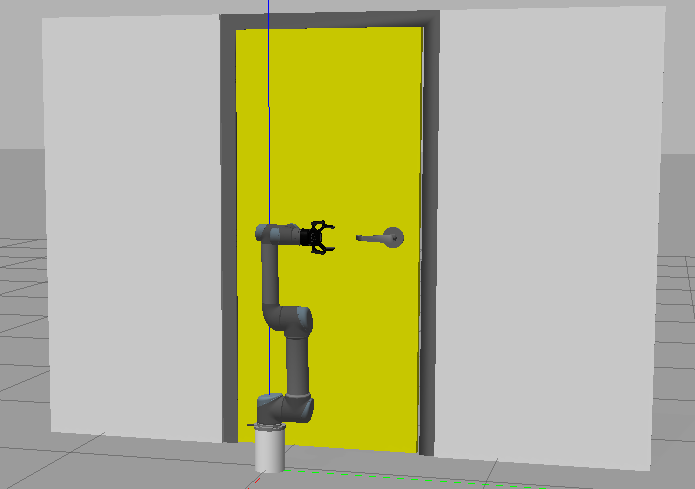
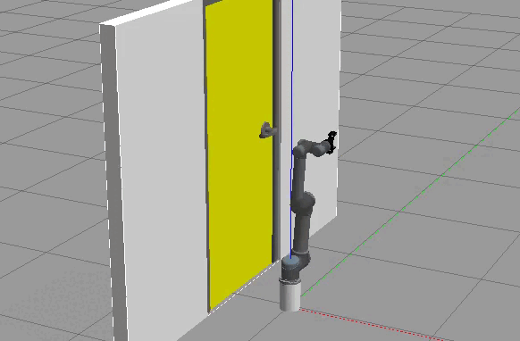

# Задача открывания двери роботом-манипулятором UR5 при помощи алгоритма TrajOpt

1. Склонировать репозиторий <code>git clone https://github.com/allicen/trajopt_ur5</code>.

 2. Перейти в папку проекта <code>cd trajopt_ur5</code>.

 3. Собрать окружение для робота в docker-контейнер: <code>sudo docker build -t trajopt-img . --network=host --build-arg from=ubuntu:20.04</code>

 

 4. Запустить робота

<u>Новое окно терминала:</u>

Запустить docker-контейнер с окружением для робота: <code>sudo ./scripts/docker/run_armbot_docker.sh</code>

Перейти в рабочую директорию <code>cd workspace</code>

Собрать проект <code>catkin build</code>

Прописать пути <code>source devel/setup.bash</code>

Запустить окружение робота <code>roslaunch ur5_single_arm_manipulation load_scene.launch</code> (загрузка с параметрами: <code>roslaunch ur5_single_arm_manipulation load_scene.launch x:=2 y:=2 z:=0</code>).

    

 

5. Запустить управление роботом

<u>Новое окно терминала:</u>

Зайти в docker-контейнер <code>sudo docker exec -ti trajopt bash</code>

Перейти в рабочую директорию <code>cd workspace</code>

Прописать пути <code>source devel/setup.bash</code>

Управление движениями: <code>roslaunch ur5_single_arm_manipulation move.launch pipeline:=trajopt</code>

 

6. Запустить команду открытия двери

<u>Новое окно терминала:</u>

Зайти в docker-контейнер <code>sudo docker exec -ti trajopt bash</code>

Перейти в рабочую директорию <code>cd workspace</code>

Прописать пути <code>source devel/setup.bash</code>

Управление движениями: <code>rosrun ur5_single_arm_manipulation open</code>

 

<b>Другие команды:</b>

Отправить команду с координатой для схвата робота: <code>rosrun ur5_single_arm_manipulation position _param:="1 2 3"</code>

Вернуть робота в позу по умолчанию <code>rosrun ur5_single_arm_manipulation pose _param:="up"</code> (варианты поз: home, up, pickup)

Разомкнуть схват на определенный угол: <code>rosrun ur5_single_arm_manipulation gripper _param:="0.564"</code> (0 - открыт полностью)

 

<b>Видео</b>

    

    

